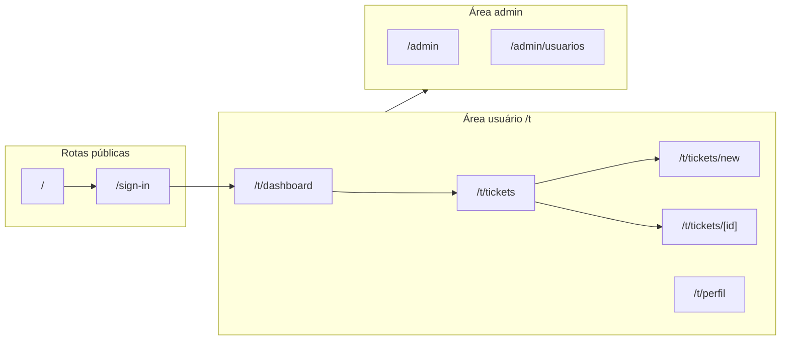

# Documentação do frontend – Sistema de Chamados

Referência do frontend da aplicação de chamados: funcionalidades, autenticação, separação de papéis e ambientes, tecnologias e UI.

---

## 1. Funcionalidades

### Rotas



### Página inicial

- **Arquivo:** [app/page.tsx](app/page.tsx)
- Visitantes não logados: botão "Login" (leva a `/sign-in`).
- Usuários autenticados: link "Dashboard" para `/t/dashboard` e botão "Logout".

### Login

- Rota `/sign-in` com o componente Clerk `<SignIn />`.
- Redirecionamento após login para `/t/dashboard`.
- Página: [app/sign-in/[[...sign-in]]/page.tsx](app/sign-in/[[...sign-in]]/page.tsx).

### Área do usuário (prefixo `/t`)

Layout compartilhado com Header e Footer ([app/(protected)/layout.tsx](app/(protected)/layout.tsx)).

| Rota | Descrição |
|------|-----------|
| **Dashboard** `/t/dashboard` | Lista de chamados com filtro por status (Total ou por status). Usa `ListStatus` e `ListTickets`. Dados via `ticketService.getAllTickets()`. |
| **Meus Chamados** `/t/tickets` | Lista de tickets do usuário e botão "Novo Chamado" para `/t/tickets/new`. Componente `TicketsList` consome o serviço de tickets. |
| **Novo chamado** `/t/tickets/new` | Formulário: categoria, título, descrição, prioridade, anexos (até 5 imagens JPG/PNG). Validação com Zod + React Hook Form. Server Action `createTicket`. Feedback com Sonner. |
| **Detalhe do chamado** `/t/tickets/[id]` | Página cliente com dados do ticket, comentários e área para novo comentário. |
| **Perfil** `/t/perfil` | Componente Clerk `<UserProfile />` para edição de perfil do usuário. |

### Área admin (prefixo `/admin`)

Layout próprio com título "Admin" ([app/(protected)/admin/layout.tsx](app/(protected)/admin/layout.tsx)). Acesso restrito à role `org:admin`.

| Rota | Descrição |
|------|-----------|
| **Admin** `/admin` | Página inicial da área admin (conteúdo placeholder). |
| **Usuários** `/admin/usuarios` | Página placeholder para gestão de usuários. |

### Header

- **Arquivo:** [components/header.tsx](components/header.tsx)
- Links para todos: Início (`/t/dashboard`), Meus Chamados (`/t/tickets`), Perfil (`/t/perfil`).
- Links de admin (ex.: Usuários `/admin/usuarios`) **somente** para usuários com role `org:admin`.
- UserButton (Clerk) e botão Sair (SignOutButton).

---

## 2. Autenticação com Clerk

### Provider

- [app/layout.tsx](app/layout.tsx): `ClerkProvider` com localização **pt-BR** (`@clerk/localizations`).
- Toda a aplicação está envolvida pelo provider para uso de auth e componentes Clerk.

### Middleware (proteção de rotas)

A lógica de proteção e verificação de admin está no arquivo **[proxy.ts](proxy.ts)** na raiz do app web. Para o Next.js aplicar essa lógica, o arquivo deve ser nomeado `middleware.ts` na raiz de `apps/web` (ou o equivalente no seu setup).

Comportamento:

- **Rotas protegidas:** `/t(.*)` e `/admin(.*)`.
- **Não autenticado** em rota protegida: `auth.protect()` (Clerk redireciona para login).
- **Role admin:** `has({ role: 'org:admin' })`.
- **Autenticado sem role admin** acessando `/admin(.*)`: redirect para `/not-found`.

A role de admin é a **Clerk Organization role** `org:admin`, configurável no dashboard do Clerk.

### Uso em código

| Contexto | Uso |
|----------|-----|
| **Servidor** | `auth()` e `currentUser()` de `@clerk/nextjs/server` (ex.: header, helpers de API). |
| **Cliente** | `useUser()` (ex.: `new-ticket-form` para preencher `createdBy`). |
| **Componentes** | `SignIn`, `SignOutButton`, `UserProfile`, `UserButton` (via [components/user-button-client.tsx](components/user-button-client.tsx)). |

### Chamadas à API

- [lib/api.ts](lib/api.ts): `getAuthHeaders()` obtém o token Clerk e monta `Authorization: Bearer <token>`.
- Usado pelo [services/ticket.service.ts](services/ticket.service.ts) em todas as requisições à API de chamados.

---

## 3. Separação de ambientes e ações usuário x admin

### Variáveis de ambiente

| Variável | Uso |
|----------|-----|
| `NEXT_PUBLIC_API_URL` | URL base da API (usada em [lib/api.ts](lib/api.ts) e em [services/ticket.service.ts](services/ticket.service.ts)). |

### Usuário x Admin

| | Usuário | Admin |
|---|--------|--------|
| **Acesso** | Área `/t` (dashboard, tickets, novo chamado, detalhe, perfil). | Tudo que o usuário tem **e** área `/admin` e `/admin/usuarios`. |
| **Header** | Links: Início, Meus Chamados, Perfil. | Links de usuário **+** Usuários (admin). |
| **Proteção** | Rotas `/t(.*)` exigem autenticação. | Rotas `/admin(.*)` exigem autenticação **e** role `org:admin`; caso contrário, redirect para `/not-found`. |

Admin também utiliza todas as ações de usuário nas rotas `/t`.

---

## 4. Tecnologias e ferramentas

### Core

- **Next.js 16.1.5** (App Router)
- **React 19.2.3**
- **TypeScript 5**

### Autenticação

- **Clerk:** `@clerk/nextjs`, `@clerk/localizations` (pt-BR).

### neverthrow (tratamento de erros)

O projeto usa **neverthrow** para tratamento explícito de erros, sem depender de exceções, com tipos seguros e fluxo previsível.

- **Onde:** [services/ticket.service.ts](services/ticket.service.ts).
- **Uso:** Todas as funções do serviço retornam `Result<T, E>` (ex.: `getAllTickets`, `getUserTickets`, `createTicket`, `updateTicketStatus`, `createComment`).
- **Tipos de erro:** [lib/errors.ts](lib/errors.ts) define `FetchError`, `CreateTicketError`, `UpdateTicketStatusError`, `CreateCommentError`.
- **Server Actions:** Ex.: [app/_actions.ts](app/_actions.ts) — `createTicket` usa `res.isErr()` e devolve `{ success, error }` para o cliente.
- **Páginas:** Ex.: dashboard usa `result.isErr()` para exibir mensagem de erro ou `result.value` para os dados.

Exemplo de uso no serviço e na página:

```ts
// Serviço retorna Result<Ticket[], FetchError>
const result = await ticketService.getAllTickets();
if (result.isErr()) {
  // result.error: FetchError
  return <p>{result.error.message}</p>;
}
// result.value: Ticket[]
return <ListTickets tickets={result.value} />;
```

Benefícios: erros tratados de forma explícita, tipagem forte e fluxo de sucesso/erro claro em toda a camada de serviço e ações.

### Formulários e validação

- **Zod:** schemas em [lib/schemas.ts](lib/schemas.ts) (ex.: `createTicketSchema`).
- **React Hook Form** + `@hookform/resolvers/zod`.
- **Server Actions** para envio (ex.: `createTicket`).

### UI e estilo

- **Tailwind CSS 4** (utility-first).
- **Shadcn UI** (estilo new-york), baseado em Radix UI e CVA; configuração em [components.json](components.json).
- **lucide-react** (ícones), **tailwind-merge**, **clsx**.

### Outros

- **Sonner:** toasts (feedback ao usuário).
- **react-dropzone:** anexos no formulário de novo ticket.
- **next-themes:** variáveis CSS para tema; suporte a dark em [app/globals.css](app/globals.css).

Versões principais: **neverthrow** 8.2.0, **Clerk** 6.37.x, **Zod** 4.3.x, **Tailwind** 4, **Sonner** 2.0.x, **react-dropzone** 14.4.x. Demais dependências em [package.json](package.json).

---

## 5. Linguagem

- **Código:** TypeScript em todo o frontend; tipos e interfaces em [lib/types.ts](lib/types.ts) (Ticket, Comment, Priority, TicketStatus).
- **Interface e textos:** português (pt-BR); Clerk configurado com localização pt-BR.

---

## 6. UI

- **Design system:** Shadcn UI (estilo new-york), componentes em `components/ui/` (Button, Card, Badge, Input, Select, Textarea, Field, Separator, etc.).
- **Estilo:** Tailwind utility-first; variáveis CSS em [app/globals.css](app/globals.css) para cores e radius (tema claro e escuro).
- **Fontes:** Geist (sans) e Geist Mono, configuradas no layout raiz.
- **Padrões:**
  - Páginas com layout centralizado e espaçamento consistente.
  - Card para formulários e blocos de conteúdo.
  - Badge para status e prioridade.
  - Toaster (Sonner) no root para feedback.
  - Field + Label + Description + Error para formulários acessíveis.
- **Tema escuro:** disponível via variáveis CSS (next-themes). Base responsiva com Tailwind (mobile-friendly).
