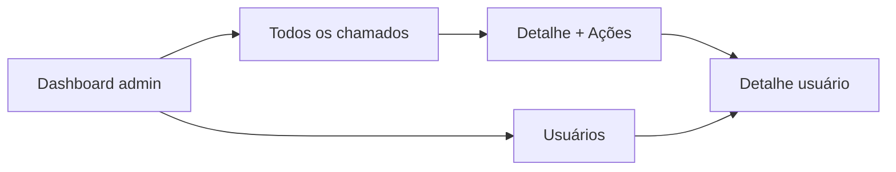

# Manual do administrador – Helpdesk

Este manual descreve o uso do sistema de chamados (Helpdesk) para o **administrador**: dashboard com métricas, todos os chamados, alteração de status, comentários e acesso aos dados de usuários.

---

## 1. Introdução

O **administrador** tem permissões adicionais em relação ao usuário comum. Você pode:

- Ver **todos** os chamados do sistema
- Acompanhar **métricas** em um dashboard (gráficos por status, categoria, prioridade e chamados da semana)
- **Alterar o status** dos chamados (Em aberto, Em andamento, Finalizado)
- **Ver dados do usuário** que abriu cada chamado
- Acessar a área de **Usuários** (listagem e detalhe)

O acesso é feito com o **mesmo login**; a diferença é que contas com perfil de **administrador** passam a ver no menu superior os links da área admin (Dashboard, Chamados, Usuários). Usuários sem perfil de admin não conseguem acessar as rotas da área administrativa e são redirecionados para uma página de não encontrado.

---

## 2. Navegação (menu superior para admin)

Quando logado como administrador, no topo da página aparecem:

- **Dashboard** – painel com gráficos e métricas dos chamados
- **Chamados** – lista de **todos** os chamados do sistema
- **Usuários** – área de gestão de usuários (listagem e detalhe)

À direita continuam disponíveis o ícone da sua conta (nome/e-mail) e o botão **Sair**.

Na **página inicial** do sistema, o administrador vê o botão **Admin Dashboard**, que leva direto ao dashboard administrativo. Se acessar diretamente a rota da área admin sem especificar uma página, o sistema redireciona para o **Dashboard** admin.

---

## 3. Dashboard admin

O **Dashboard** é a página inicial da área administrativa e mostra um resumo visual dos chamados.

### Conteúdo

- **Gráfico por status** – quantidade de chamados em: Em aberto, Em andamento, Finalizado
- **Gráfico por categoria** – distribuição dos chamados por categoria (Sistema, Hardware, Software, Rede, Segurança, Outro, etc.)
- **Gráfico por prioridade** – quantidade em Normal e Urgente
- **Chamados abertos nesta semana** – card ou indicador com o número de chamados criados na semana atual

Os dados são calculados com base em **todos** os tickets do sistema.

---

## 4. Todos os chamados

Na página **Chamados** você vê a lista de **todos** os chamados, de todos os usuários.

### Filtros

Os filtros são os mesmos da área do usuário:

- **Cards de status**: Total, Em aberto, Em andamento, Finalizados
- **Prioridade**: Todos, Normal, Urgente
- **Categoria**: Todos ou uma categoria específica

### Lista

Cada card exibe título, status, prioridade, categoria, descrição, data de criação, quantidade de comentários e o **nome do autor** do chamado. Ao **clicar em um card**, você abre o **detalhe do chamado** na área admin.

---

## 5. Detalhe do chamado (admin)

Ao abrir um chamado na lista admin, a página de detalhe mostra as mesmas informações que o usuário vê (título, descrição, autor, responsável, data, anexos, comentários) e ainda um **formulário para adicionar comentário**. As diferenças para o usuário são:

### Botão Voltar

O botão **Voltar** retorna à lista **Todos os chamados** da área admin (e não à lista “Meus chamados”).

### Menu Ações

No detalhe do chamado existe o botão **Ações** (menu com opções):

- **Ver usuário** – abre a página de **detalhe do usuário** que criou o chamado (e-mail, nome, role, status, datas).
- **Mudar status** – submenu com três opções:
  - **Em aberto**
  - **Em andamento**
  - **Finalizado**

Ao escolher um status, o sistema atualiza o chamado, exibe uma mensagem de sucesso e atualiza a página. Use essa opção para acompanhar e encerrar o atendimento.

---

## 6. Usuários

A área **Usuários** é destinada à gestão de usuários do sistema.

### Listagem de usuários

A página de listagem (Usuários) atualmente exibe apenas o título da seção. A listagem completa de usuários está em desenvolvimento; o acesso ao **detalhe** do usuário é feito a partir do detalhe do chamado (Ações → Ver usuário).

### Detalhe do usuário

Na página de detalhe do usuário são exibidas:

- Identificador do usuário (ID)
- E-mail
- Nome
- Papel (role) no sistema
- Status (Ativo ou Inativo)
- Data de criação
- Data de atualização

Use essa tela para consultar as informações do autor de um chamado quando estiver na página de detalhe do ticket (Ações → Ver usuário).

---

## 7. Uso da área do usuário pelo admin

O administrador **pode** usar normalmente a área do usuário:

- **Meus chamados** – ver e filtrar apenas os chamados que ele mesmo criou
- **Criar chamado** – abrir novos chamados como qualquer usuário
- **Perfil** – editar nome, e-mail, senha

Para isso, basta acessar as rotas correspondentes à área do usuário (por exemplo, pela URL ou por links que levem a “Meus chamados” ou “Criar Chamado” na área `/t`). O menu superior do admin mostra os links da área admin; para acessar a área do usuário, use a URL diretamente ou o botão/links disponíveis na aplicação que levem para `/t/dashboard`, `/t/tickets/new` ou `/t/perfil`.

---

## 8. Resumo de permissões

| Ação | Usuário comum | Administrador |
|------|----------------|----------------|
| Ver apenas os próprios chamados | Sim | Sim |
| Ver todos os chamados do sistema | Não | Sim |
| Criar novo chamado | Sim | Sim |
| Adicionar comentários nos próprios chamados | Sim | Sim |
| Adicionar comentários em qualquer chamado | Não | Sim |
| Alterar status do chamado | Não | Sim |
| Acessar dashboard com gráficos (métricas) | Não | Sim |
| Acessar área Usuários e detalhe de usuário | Não | Sim |
| Ver usuário que abriu o chamado (link no detalhe) | Não | Sim |

---

## Resumo do fluxo (telas admin)

O diagrama abaixo resume as principais telas da área administrativa.

