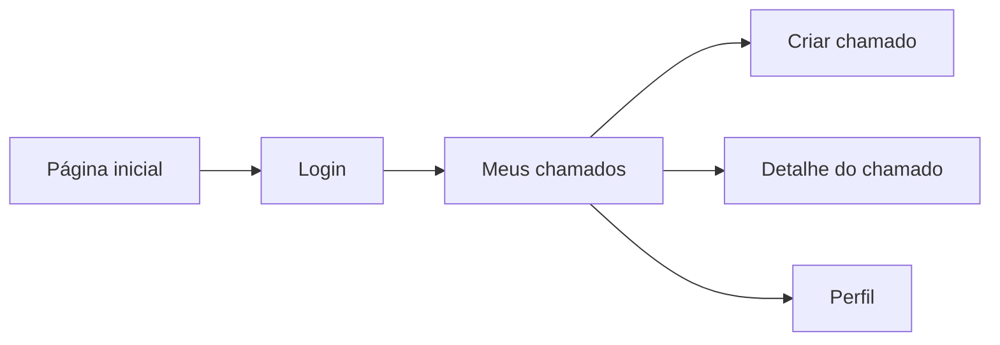

# Manual do usuário – Helpdesk

Este manual descreve o uso do sistema de chamados (Helpdesk) para o **usuário comum**: como entrar, criar e acompanhar chamados, editar o perfil e sair do sistema.

---

## 1. Introdução

O Helpdesk é um sistema para **abertura e acompanhamento de chamados** de suporte. Como usuário, você pode:

- Ver apenas os **seus** chamados
- Criar novos chamados com categoria, título, descrição, prioridade e anexos
- Acompanhar o status e adicionar comentários em cada chamado
- Editar seu perfil (nome, e-mail, senha)

Para acessar o sistema, abra a URL do sistema no navegador. Na página inicial, use o botão **Login** para entrar.

---

## 2. Entrando no sistema

1. Acesse a **página inicial** do sistema.
2. Se você ainda não estiver logado, clique no botão **Login**.
3. Na tela de **login**, informe suas credenciais (e-mail e senha) e faça o acesso.
4. Após o login, você será redirecionado automaticamente para a página **Meus chamados** (Dashboard).

---

## 3. Navegação (menu superior)

No topo da página você verá:

- **Início** – leva à lista dos seus chamados (Meus chamados)
- **Criar Chamado** – abre o formulário para criar um novo chamado
- **Perfil** – abre a página de edição do seu perfil

À direita aparecem seu nome/e-mail (com opções da conta) e o botão **Sair**, que encerra a sessão e retorna à tela de login.

---

## 4. Início (Meus chamados)

Na página **Meus chamados** você vê apenas os chamados que **você criou**.

### Filtros

- **Cards de status** (clique para filtrar):
  - **Total** – todos os seus chamados
  - **Em aberto** – chamados ainda não atendidos
  - **Em andamento** – chamados sendo tratados
  - **Finalizados** – chamados encerrados

- **Prioridade** – menu que permite filtrar por: Todos, Normal ou Urgente.
- **Categoria** – menu que permite filtrar por: Todos ou por uma categoria específica (por exemplo: Sistema, Hardware, Software, Rede, Segurança, Outro).

### Lista de chamados

Cada chamado aparece em um card com:

- Título
- Status (Em aberto, Em andamento, Finalizado)
- Prioridade (Normal, Urgente)
- Categoria
- Descrição (resumo)
- Data de criação
- Quantidade de comentários
- Seu nome como autor

**Clique em um card** para abrir o **detalhe do chamado**.

---

## 5. Criar novo chamado

Acesse **Criar Chamado** pelo menu superior ou pela rota correspondente ao novo chamado.

### Campos do formulário

| Campo        | Obrigatório | Regras |
|-------------|-------------|--------|
| **Categoria** | Sim        | Escolha uma: Sistema, Hardware, Software, Rede, Segurança, Outro |
| **Título**    | Sim        | Texto claro e objetivo, até 100 caracteres |
| **Descrição** | Sim        | Entre 10 e 1000 caracteres, descrevendo o problema ou solicitação |
| **Prioridade**| Sim        | Normal ou Urgente |
| **Anexos**    | Não        | Até 5 arquivos; apenas imagens JPG, JPEG ou PNG; cada arquivo até 1 MB |

### Envio

1. Preencha todos os campos obrigatórios e, se quiser, adicione anexos.
2. Clique em **Criar ticket**.
3. Se tudo estiver correto, uma mensagem de sucesso será exibida e você será levado à **página de detalhe do chamado** que acabou de criar.

Se algum campo estiver inválido, o sistema mostrará as mensagens de erro no formulário; corrija e envie novamente.

---

## 6. Detalhe do chamado

Ao clicar em um chamado na lista, você abre a **página de detalhe** daquele chamado.

### O que você vê

- Botão **Voltar** – retorna à lista Meus chamados
- **Título** do chamado e um identificador curto (ID)
- **Status** – Em aberto, Em andamento ou Finalizado
- **Descrição** completa
- **Autor** (seu nome) e **Responsável** (se houver alguém atribuído)
- **Data e hora** de criação

### Anexos

- Lista de arquivos anexados ao chamado.
- Imagens podem ter preview; para outros tipos, use o link para abrir o arquivo.

### Comentários

- Os comentários aparecem em **ordem cronológica** (do mais antigo ao mais recente).
- Cada comentário mostra o **nome do autor** e a **data/hora**.
- No final da lista há um **formulário para adicionar um novo comentário**: digite o texto e envie para registrar sua mensagem no chamado.

### Acesso restrito

Você só pode abrir o detalhe dos **seus** chamados. Se tentar acessar um chamado que não é seu ou que não existe, uma mensagem de erro será exibida e você poderá usar o link para voltar ao dashboard.

---

## 7. Perfil

No menu superior, clique em **Perfil** para abrir a página de **edição do seu perfil**.

Nessa página você pode alterar, por exemplo:

- Nome
- E-mail
- Senha

Use o botão **Voltar** para retornar à lista Meus chamados.

---

## 8. Saindo do sistema

No menu superior, clique em **Sair**. Sua sessão será encerrada e você será redirecionado para a tela de **login**. Para usar o sistema novamente, faça login outra vez.

---

## Resumo do fluxo (telas)

O diagrama abaixo resume as principais telas disponíveis para o usuário comum.

